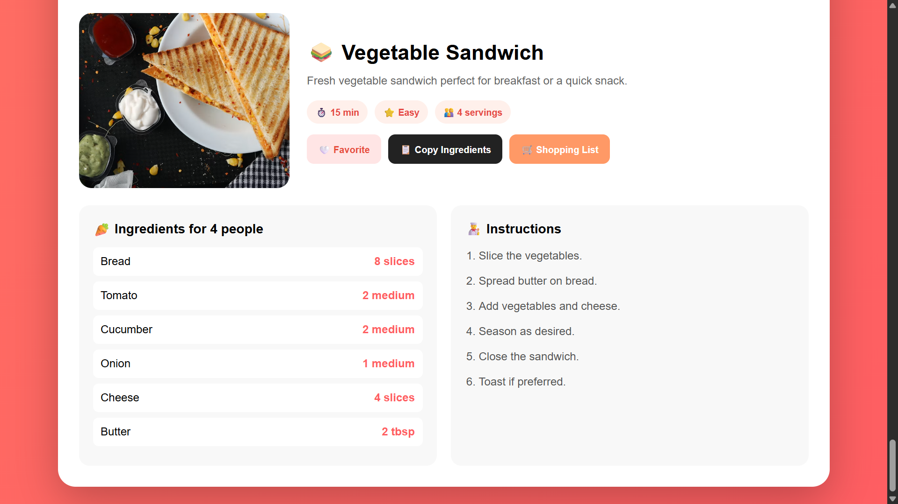
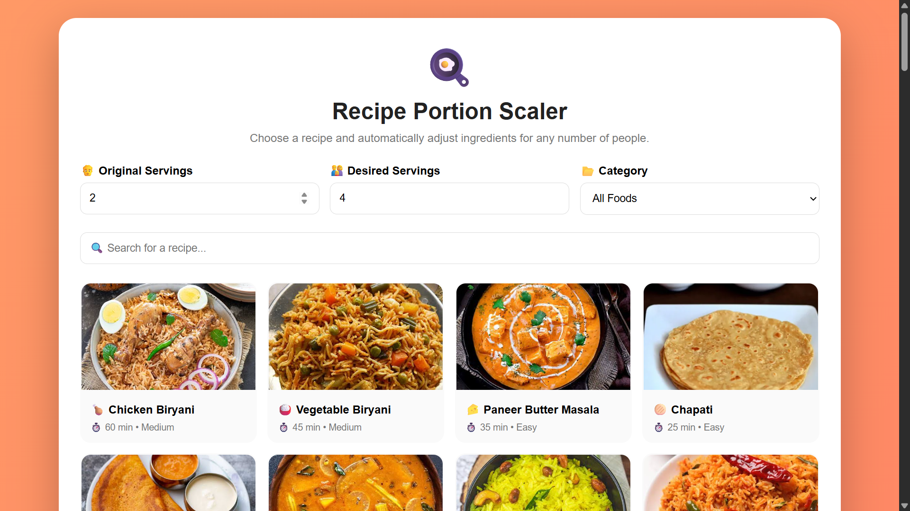

# Recipe-portion-Scalar

Recipe Portion Scaler is a smart cooking tool that automatically adjusts ingredient quantities based on the number of servings required. Users can enter a recipe, set the original serving size, and choose the desired number of servings. The system instantly recalculates all ingredient quantities, making it easy to prepare meals for individuals, families, or larger groups without manual calculations.

## 🎥 project Demo


[Project Demo]()

## 🚀 project Demo
[Live Demo]()

### Ingedrient
A quick and delicious sandwich made with fresh tomato, cucumber, onion, cheese, and butter between soft bread slices. It is an easy breakfast or snack that can be toasted for a crispy and flavorful finish.



### Recipe
A quick and delicious sandwich made with fresh tomato, cucumber, onion, cheese, and butter between soft bread slices. It is an easy breakfast or snack that can be toasted for a crispy and flavorful finish.



✨ Features

🧮 Automatic ingredient quantity calculation

👨‍👩‍👧‍👦 Adjust recipes for different serving sizes

🥄 Supports common cooking measurements

➕ Add and manage ingredients

🔄 Instantly update ingredient quantities

💾 Save recipes using LocalStorage

❤️ Favorite recipes

🔍 Search recipes

🛒 Generate a shopping list

⏱️ Cooking timer

🌙 Dark and light mode

📱 Fully responsive design

🖨️ Print-friendly recipe view

🔗 Share recipes easily

💰 Optional cost-per-serving calculation

## 🛠 Tech Stack

* HTML5
* CSS3
* JavaScript

## 📁 Project Structure

```text
📁 Recipe portion scalar
│
├── 📄 index.html
└── 📁 image
    │
    ├── 🖼️ indegrident.png
    └── 🖼️ recipe.png
```
## 📈 Future Enhancements

Future versions can include:

🤖 AI recipe recommendations

📷 Recipe image/OCR scanning

🧠 AI ingredient recognition

🥗 Nutrition and calorie calculation

💰 Ingredient cost estimation

📊 Meal planning

🛍️ Automatic grocery list generation

🎤 Voice-based ingredient entry

☁️ Cloud recipe synchronization

👤 User accounts

📤 Recipe sharing

📄 PDF recipe export


